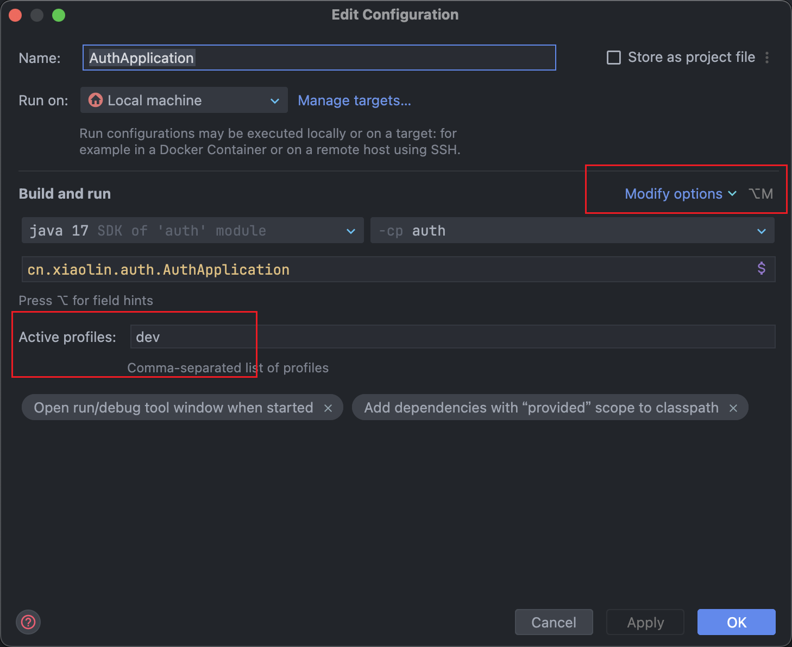

# 基于 SpringCloud 的视频点播微服务（后端项目）

> 个人搭建企业级微服务项目：微服务架构设计，DevOps 实践，可观测性实践，CI/CD 实践，K8s 容器编排与管理实践。

本项目全面涉及到了 Java 技术栈的主流技术组件，包括但不限于 SpringBoot MySQL Redis MybatisPlus Nacos Dubbo RocketMQ Minio 等。

---

## 更新日志

2025-06-17：生产服务与可观测性服务分离。

待办：探讨可观测性服务与生产服务的部署方式，如何解耦合。

项目中包含两个 `docker-compose` 配置文件，包括 `mini-prod.yaml` 和 `mini-obvervability.yaml`

执行方式（单点）：

首次需要创建网络 magic-backend-network，如果没创建会报错
```shell
docker network create magic-backend-network
```

依次启动 2 个服务集群

```shell
docker compose -p prod -f mini-prod.yaml up -d

docker compose -p obvervability -f obvervability.yaml up -d
```


容器集群卸载：

```shell
docker compose -p obvervability -f obvervability.yaml down

docker compose -p prod -f mini-prod.yaml down
```


2024-09-22 构建 docker-compose 运行脚本

- 本地环境 local：容器运行
- 开发环境 dev：宿主机运行

---

2024-10-16 minio 替换 aliyun-oss

- 本地缓存内容过多，导致启动容器失败，定期清理 docker 本地缓存
- .dev.env .local.env 设置 docker-compose 环境变量，cli 启动时增加参数`--env-file`
- 容器名称变更，magic-core magic-auth 等
- hls 微服务完善，支持视频编码为 dash 和 hls
- 中间件数据文件、配置文件本地 volume 映射，新增 volume 文件夹统一管理
- 删除 .gitignore 文件中的 test/ 目录，允许将单元测试添加到 git 仓库

## 微服务文档

[Auth 权限微服务](/auth/README.md)

[Gateway 微服务网关](/gateway/README.md)

[Core 核心微服务](/core/README.md)

[Has 视频编码微服务](/has/README.md)

[Multimedia 多媒体微服务](/multimedia/README.md)

## 待办Todos

- [ ]  搭建 Maven 私有仓库 Nexus
- [ ]  搭建私有代码托管仓库 GitLab
- [ ]  配置文件与微服务解耦，密钥相关专门存储，包括数据库、Redis、RabbitMQ等
- [ ]  本地自动构建、自动运行脚本
- [ ]  开发环境关闭权限校验，完善代码灵活性
- [X]  SpringCloudGateway 及其他微服务组件 healthcheck
- [X]  关闭 docker-compose-local 中暴露的本地端口，只支持容器内通信
- [ ]  各组件如 Redis、MySQL、RabbitMQ 连通性单元测试
- [X]  minio 使用非9000、9001 端口无法启动
- [ ]  单元测试依赖其他配置，如 MySQL、Redis、RabbitMQ 等
- [X]  部署 Prometheus 监控 Nginx 流量
- [ ]  docker-compose-local 中容器名变更
- [ ]  支持 K8s 容器编排和管理
- [X]  快速启动文档更新，local 和 dev 模式两种启动方式
- [ ]  容器镜像依赖 tag，全部更新为确定版本，而不要使用默认 latest
- [ ]  项目微服务关系架构图展示
- [X]  重新安排 pom 依赖，应满足最小依赖原则
- [X]  将视频存储在 minio，替代 aliyun-oss：替换已完成，但实际生产环境阿里云 OSS 更适合
- [X]  开发环境编排顺序，一键启动各微服务
- [X]  定义清楚微服务启动上的拓扑依赖关系：当前还简单
- [X]  配置可观测性能力，Prometheus 和 Loki，存在 mount 挂载问题
- [ ]  可观测性容器 Promtail Loki Prometheus 的健康检查
- [X]  使用 腾讯云 媒体处理 转码工具，支持 DASH 格式：审核不通过，自定义 Python 脚本实现
- [ ]  使用 K8S 部署容器集群
- [ ]  流媒体 dash 协议扩展 hls 协议
- [ ]  可观测性能力与业务能力相分离
- [ ]  日志打印统一格式，日志级别统一

---

## 更新日志


## Java服务端开发基础知识

> 本项目使用Java技术栈，想要参与到本项目的开发工作，需要具备以下基础知识

### 基础能力

Java 基础知识：面相对象编程、集合、线程池

计算机基础知识：计算机网络、操作系统、Linux 基础

版本管理：Git GitHub

容器化：Docker & Docker-Compose

### 进阶能力

Java 基础知识：Java IO、JVM、锁

编程技巧：stream 流、设计模式

数据库：Redis、MySQL

微服务：

- 分布式基础知识：CAP 理论、分布式 ID、远程过程调用 RPC（Dubbo、gRPC）
- 数据库ORM工具：MybatisPlus
- 注册中心：Nacos、Eureka、Zookeeper
- 消息队列：RabbitMQ、Kafka
- 配置中心：Nacos、ConfigServer

CI/CD：

- 持续集成：Jenkins
- 容器编排：docker-compose、k8s

---

## 快速开始

**克隆项目**

```shell
git clone git@github.com:xiaolinstar/magic-video-backend.git
# git clone https://github.com/xiaolinstar/magic-video-backend.git
```

**进入目录**

```
cd magic-video-backend
```

### 本地模式体验 local

#### 快速启动

> 组件和微服务全部容器化，使用 docker-compose 编排，无需任何配置。
>
> 配置环境设置为 local

注意：DockerHub 仓库中镜像支持 amd64 架构，如使用其他架构，需要手动构建镜像

**docker compose 启动**

修改本地参数

**重要：根目录下 `.local.dev` 中地址修改**

在终端中输入

> docker compose 启动
> 
> 指定当前目录下的 -f docker-compose-local.yaml 文件（默认：docker-compose.yaml 时可以不指定）
> 
> 指定环境变量文件 --env-file .local.env
> 
> 启动 up，以后台方式运行 -d
> 

```shell
docker compose -f docker-compose-local.yaml --env-file .local.env up -d
```

容器卸载

> 不再使用的时候记得执行该指令关闭所有容器
> 
> 注意不能使用 docker compose down，而是与启动命令相反
> 

```shell
docker compose -f docker-compose-local.yaml --env-file .local.env down 
```

#### 手动编译镜像启动

> docker 容器的迁移性与处理器体系架构有关，如 linux/arm64 linux/amd64
> 
> 如果 dockerhub 没有所需镜像，或镜像不是所需版本，可在本地自行构建
> 

**编译项目(本地打包)**

> 本项目包含项目级 maven ，但下述在终端执行的命令需本地用户级 maven

```shell
# 跳过单元测试
mvn clean package -Dmaven.test.skip=true 
```

本项目中包含多个微服务，编译后生成的 `jar` 包，在每个微服务的 `target` 目录中。

**构建容器镜像**

> 基于本地源代码构建镜像，会自动匹配宿主机 CPU 架构

```shell
docker build -t xxl1997/magic-auth:0.0.1-SNAPSHOT auth/.
docker build -t xxl1997/magic-gateway:0.0.1-SNAPSHOT gateway/.
docker build -t xxl1997/magic-multimedia:0.0.1-SNAPSHOT multimedia/.
docker build -t xxl1997/magic-core:0.0.1-SNAPSHOT core/.
docker build -t xxl1997/magic-has:0.0.1-SNAPSHOT has/.
```

**启动容器集群（本地开发环境）**

创建并启动

```shell
docker compose -f docker-compose-local.yaml --env-file .local.env up -d
```

容器卸载

```shell
docker compose -f docker-compose-local.yaml --env-file .local.env down
```

### 开发模式启动 dev

> docker-compose 启动所依赖的中间件，本地 IDEA 启动微服务，将容器端口映射到宿主机

**docker compose 启动 dev 环境**

修改 `.dev.env` 中环境变量

`docker-compose.yaml` 中只包含中间件

```shell
docker compose -f docker-compose-dev.yaml --env-file .dev.env up -d
```

在IDEA中设置所有微服务启动参数 `dev`



依次启动以下微服务

> 微服务间有顺序上的依赖关系 

待定，因为微服务还未完全应用。

auth > gateway

core > has

core > multimedia

--- 

## 项目配置

**端口配置原则**

容器与宿主机端口映射约定：

- 默认一致性映射，例如 "9000:9000"
- 若存在多个容器时，端口号增加前缀 5，如 "59001:9001"

**微服务端口概览**


| 微服务/组件 | 名称               | 宿主机端口     | 容器端口       |
| ----------- | ------------------ | -------------- | -------------- |
| auth        | 鉴权微服务         | 8999           | 8999           |
| gateway     | 网关微服务         | 9000           | 9000           |
| core        | 核心微服务         | 9001           | 9001           |
| multimedia  | 多媒体微服务       | 9002           | 9002           |
| has         | http自适应流微服务 | 9003           | 9003           |
| nacos       | 注册中心/配置中心  | 8848 9848 9849 | 8848 9848 9849 |
| mysql       | 关系型数据库       | 3306           | 3306           |
| auth-redis  | 鉴权分布式缓存     | 6379           | 6379           |
| redis       | 分布式缓存         | 6389           | 6379           |
| rabbitmq    | 消息队列           | 5672 15672     | 5672 15672     |
| minio       | 对象存储           | 9010 9011      | 9000 9001      |

---

## 服务介绍

### Auth 权限微服务

流行的鉴权框架主要有

| 框架             | 描述                | 许可证               | 能力  |
|----------------|-------------------|-------------------|-----|
| SpringSecurity | Spring原生安全组件      | Apache License V2 | 重量级 |
| Apache Shiro   | 简单的 Java 安全组件     | Apache License V2 | 轻量级 |
| SaToken        | 完美适配 Spring 国产安全组件 | Apache License V2 | 轻量级 |
| Casbin         | 全面跨平台安全组件         | Apache License V2 | 轻量级 |


本项目使用了文档友好的 [SaToken](https://sa-token.cc/)。

微服务下实现认证授权的方案：基于 Redis 实现分布式 Session

**环境依赖**

- 注册中心/配置中心：nacos
- 权限关系数据库：mysql
- SaToken 分布式缓存：auth-redis
- RPC服务提供者：dubbo

---

### 网关 Gateway

网关 Gateway 是后端服务的入口，访问后端请求统一由 Gateway 进行路由和调度。配合 Nacos 注册中心，实现负载均衡，将流量路由到**服务**，而不是**实例**。

认证授权统一在网关处理，网关后面的微服务与权限服务解耦合。

**环境依赖**

- 注册中心/配置中心：nacos
- SaToken 分布式缓存：auth-redis
- RPC服务提供者：dubbo

---

### Core 核心微服务

视频点播相关的视频、资源、导演、编剧等增删改查操作。

**环境依赖**

- 注册中心/配置中心：nacos
- 关系数据库：mysql
- 分布式缓存：redis
- 消息队列：rabbitmq

### Has 视频编码微服务

视频转码微服务，支持视频编码为 dash 和 hls。

**环境依赖**

- 注册中心/配置中心：nacos
- 关系数据库：mysql
- 消息队列：rabbitmq

### Multimedia 多媒体微服务

图像、视频等前端上传资源逻辑处理，数据存储。

**环境依赖**

- 注册中心/配置中心：nacos
- 关系数据库：mysql
- 消息队列：rabbitmq
- 对象存储：minio

## CI/CD 支持

持续集成、持续部署

## 参考
