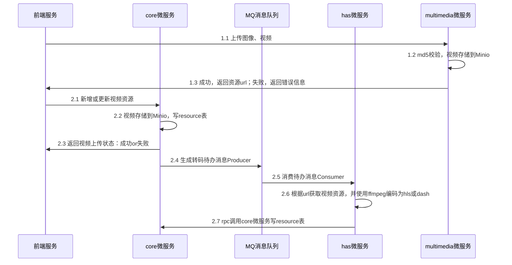

# Http Adaptive Streaming视频转码

将视频转码为dash和hls格式

## 更新日志

2024-10-28 更新文档目录结构

## Todos

- [ ]  ffmpeg转码dash
- [ ]  ffmpeg转吗hls
- [ ]  mysql依赖是需要的吗？

## 开发文档

**视频在服务端编码为hls和dash格式**

同步关系：步骤7与步骤6同步

## 参考

参考内容