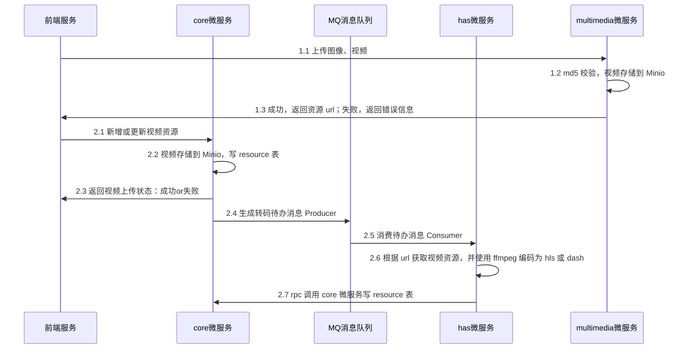

# Http Adaptive Streaming视频转码

将视频转码为dash和hls格式

## 更新日志

2024-10-28 更新文档目录结构

## Todo

- [ ]  ffmpeg 脚本优化
- [ ]  ffmpeg 转码 dash
- [ ]  ffmpeg 转码 hls
- [ ]  mysql 依赖是需要的吗？不需要的话删除

## 开发文档

**视频在服务端编码为 hls 和 dash 格式**

待思考的问题：

1. 大视频上传需要**分片上传**，需要在前端分片，如何保证后端接收到完整的分片？
2. 视频转码需要**进度**，如何保证转码进度可以实时反馈给前端？
3. 视频转码需要**异步**，转码完成后是否需要通知前端，如何实现？
4. 后端接收到视频资源后，需要合并吗？
5. 视频存储到 minio 时会自动分片，ffmpeg 编码 dash 和 hls 需完整视频块？服务端存储合并视频，ffmpeg 分片后传输到 minio，然后在服务端删除原视频。

## 参考

