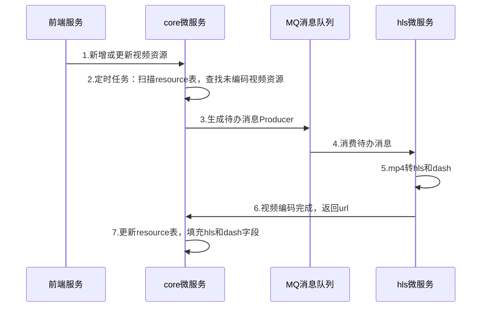

# Http Adaptive Streaming视频转码
The following was discovered as part of building this project:

* No Docker Compose services found. As of now, the application won't start! Please add at least one service to the `compose.yaml` file.

## Todos

## 开发文档

**视频在服务端编码为hls和dash格式**

同步关系：步骤7与步骤6同步
代码实现：远程关系调用，在hls微服务远程调用core微服务

