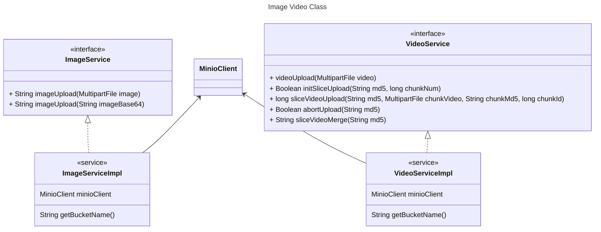
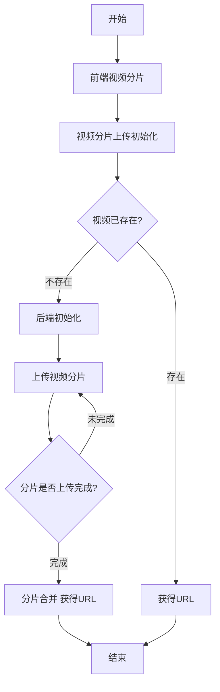

# 多媒体微服务

图片、视频等静态资源上传和存储服务

## 更新日志

## Todo

- [X]  视频存储在本地
- [X]  上传整个文件
- [ ]  更优雅的代码结构
- [ ]  HLS 编码生成 master.m3u8
- [ ]  DASH 视频编码
- [ ]  HLS 和 DASH 编码支持动态参数
- [ ]  CleanupServiceImpl 类优化，使用自动关闭机制
- [ ]  定时任务扫描 resource 数据库，转 hls 和 dash
- [ ]  从网络上下载资源，并存储到 minio 库
- [X]  multimedia 不需要连接 mysql，删除相关依赖和配置

## 环境依赖

- 注册中心Nacos
- MinIO：配置文件中设置MinIO access-key和secret-key
- FFmpeg：在Dockerfile中下载

## 服务功能

### 图片视频服务

用户在前端页面中上传图像，图像信息默认包含：

- 图像名：用户本地自定义图像名
- 图像格式：png、jpg、jpeg、bmp等
- 图像规格：800x600
- 图像大小：不大于10MB

返回值：获取文件的url

前后端均需要对图像规格和图像大小进行校验

**图像视频UML类图**

**视频分片上传**

## 参考
